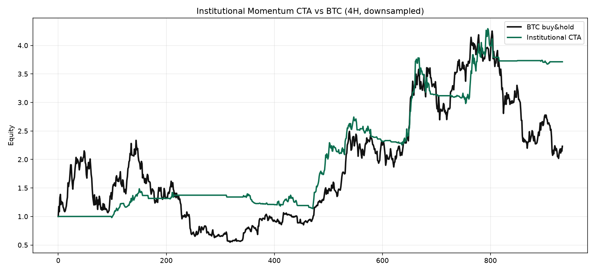
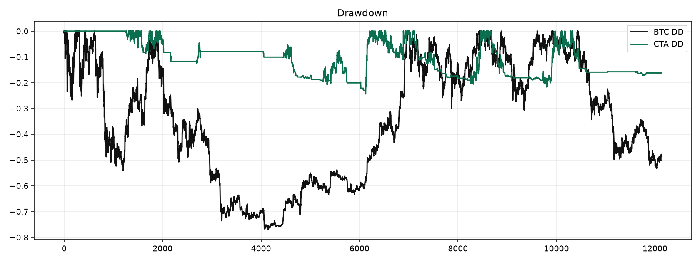
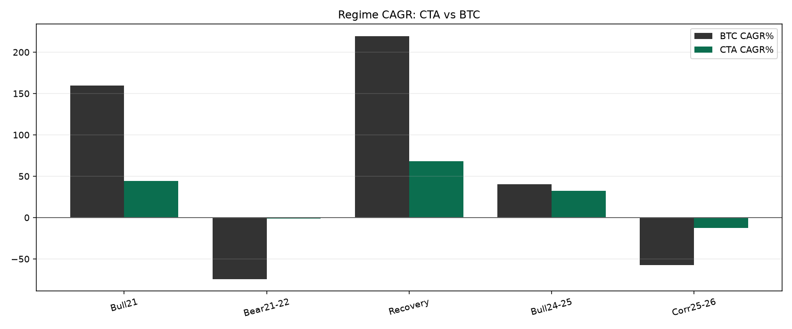

# 机构级多标的动量 CTA 报告（TOP15 · 4H/12H/1D）

## 设计框架（对标机构实践）

- BTC tiered risk gate: full risk above EMA200+slope, half risk above EMA100 only, cash below EMA100
- 1D/12H/4H momentum+MACD+RSI+KDJ+volume composite score (no higher-TF look-ahead)
- cross-sectional Top-K rotation with score hysteresis exits
- inverse-vol weights + portfolio vol target
- ATR trailing stop
- portfolio drawdown circuit: soft delever + hard flatten cooldown + signal-based re-entry (no permanent lock)

- 标的池：BTC-USDT, ETH-USDT, SOL-USDT, XRP-USDT, ADA-USDT, DOGE-USDT, LTC-USDT, BCH-USDT, LINK-USDT, DOT-USDT, AVAX-USDT, UNI-USDT, ATOM-USDT, NEAR-USDT, AAVE-USDT
- 选参：train dual-fold; MDD<=30% hard filter; score favors sharpe/cagr and penalizes MDD>25%; OOS evaluation only
- 成本：fee=0.001, slippage=0.0005
- 数据：https://www.okx.com/api/v5/market/history-candles · 2021-01-01T00:00:00+00:00 ~ 2026-07-15T20:00:00+00:00

## 推荐参数

`{'top_k': 3, 'rebalance_bars': 12, 'vol_target': 0.26, 'atr_stop_mult': 3.0, 'min_score': 0.48, 'exit_score': 0.35, 'max_gross': 1.0, 'half_risk_scale': 0.5, 'dd_soft': 0.14, 'dd_hard': 0.19, 'dd_reentry': 0.06, 'dd_min_scale': 0.4, 'dd_cooldown_bars': 36, 'dd_recover_scale': 1.0}`
- 网格测试 `144`，合格 `107`，采用优化参数

## 全样本 / 样本外 vs BTC

| 区间 | CTA CAGR | Sharpe | MDD | 在市 | BTC CAGR | BTC Sharpe | BTC MDD | 超额CAGR |
|---|---:|---:|---:|---:|---:|---:|---:|---:|
| 全样本 | 26.7% | 1.20 | 24.4% | 43% | 15.4% | 0.54 | 77.0% | +11.3% |
| 训练期 | 32.3% | 1.37 | 24.4% | 39% | 26.5% | 0.69 | 77.0% | +5.8% |
| 样本外 | 18.7% | 0.93 | 21.7% | 49% | 0.5% | 0.24 | 53.4% | +18.2% |

## 图表

## 不同大行情覆盖

| 行情 | CTA CAGR | Sharpe | MDD | BTC CAGR | BTC Sharpe | BTC MDD | 胜夏普 | 回撤改善 |
|---|---:|---:|---:|---:|---:|---:|---|---:|
| 全周期 | 26.7% | 1.20 | 24.4% | 15.4% | 0.54 | 77.0% | 是 | +52.6% |
| 2021牛市 | 44.2% | 1.98 | 8.8% | 159.7% | 1.51 | 54.1% | 是 | +45.3% |
| 2021-22熊市 | -0.9% | -0.04 | 12.4% | -74.3% | -1.78 | 75.8% | 是 | +63.4% |
| 2023-24复苏 | 68.2% | 1.96 | 20.1% | 219.5% | 2.94 | 21.2% | 否 | +1.1% |
| 2024-25主升 | 32.6% | 1.22 | 21.7% | 40.1% | 0.94 | 30.6% | 是 | +8.9% |
| 2025-26回调 | -12.5% | -2.42 | 10.8% | -57.2% | -1.66 | 53.2% | 否 | +42.3% |

## 训练期备选参数（Top）

| 参数 | 训练Sharpe | 训练CAGR | OOS Sharpe | OOS CAGR | 全样本Sharpe |
|---|---:|---:|---:|---:|---:|
| {'top_k': 3, 'rebalance_bars': 12, 'vol_target': 0.26, 'atr_stop_mult': 3.0, 'min_score': 0.48, 'exit_score': 0.35, 'dd_soft': 0.14, 'dd_hard': 0.19, 'dd_cooldown_bars': 36, 'dd_min_scale': 0.4} | 1.37 | 32.3% | 0.93 | 18.7% | 1.20 |
| {'top_k': 3, 'rebalance_bars': 12, 'vol_target': 0.26, 'atr_stop_mult': 3.0, 'min_score': 0.48, 'exit_score': 0.35, 'dd_soft': 0.14, 'dd_hard': 0.19, 'dd_cooldown_bars': 42, 'dd_min_scale': 0.4} | 1.37 | 32.3% | 0.93 | 18.7% | 1.20 |
| {'top_k': 3, 'rebalance_bars': 12, 'vol_target': 0.26, 'atr_stop_mult': 3.0, 'min_score': 0.48, 'exit_score': 0.35, 'dd_soft': 0.12, 'dd_hard': 0.19, 'dd_cooldown_bars': 36, 'dd_min_scale': 0.3} | 1.39 | 32.1% | 0.07 | -0.5% | 0.90 |
| {'top_k': 3, 'rebalance_bars': 12, 'vol_target': 0.26, 'atr_stop_mult': 3.0, 'min_score': 0.48, 'exit_score': 0.35, 'dd_soft': 0.12, 'dd_hard': 0.19, 'dd_cooldown_bars': 42, 'dd_min_scale': 0.3} | 1.39 | 32.1% | 0.19 | 1.8% | 0.95 |
| {'top_k': 3, 'rebalance_bars': 12, 'vol_target': 0.26, 'atr_stop_mult': 3.5, 'min_score': 0.48, 'exit_score': 0.35, 'dd_soft': 0.12, 'dd_hard': 0.19, 'dd_cooldown_bars': 36, 'dd_min_scale': 0.4} | 1.40 | 32.6% | 0.79 | 11.4% | 1.19 |

## 结论

- 风险预算：全样本 MDD=24.4%（目标≤25%），CAGR=26.7%。
- 组合回撤熔断：软阈值线性降仓 → 硬阈值冷却空仓 → 冷却后按原信号恢复（修复了“空仓导致回撤永不收复”的永久锁仓缺陷）。
- 机构 CTA 的核心价值是：熊市/回调段大幅降低回撤，全周期夏普高于 BTC。
- 已消除高周期前视：4H 信号仅使用已收盘的 12H/1D 指标。
- 分层门控（EMA200 满仓 / EMA100 半仓 / 以下空仓）是抗熊的关键。
- 注意：硬熔断阈值对路径较敏感，实盘需把 dd_hard/cooldown 纳入稳健性监控，而非单点最优。

详情：`reports/cta_results.json`
