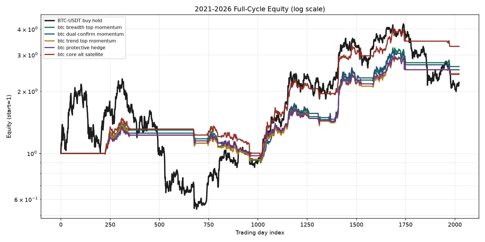
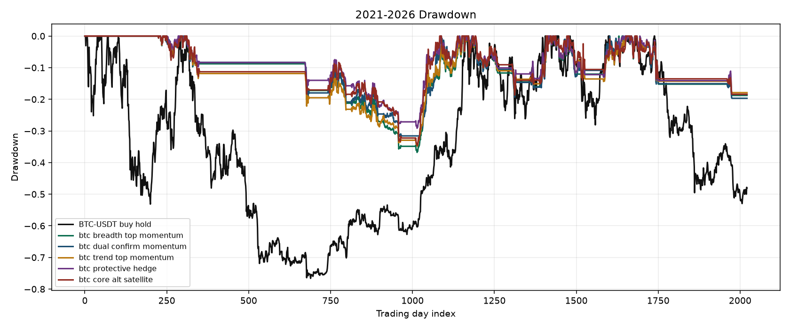
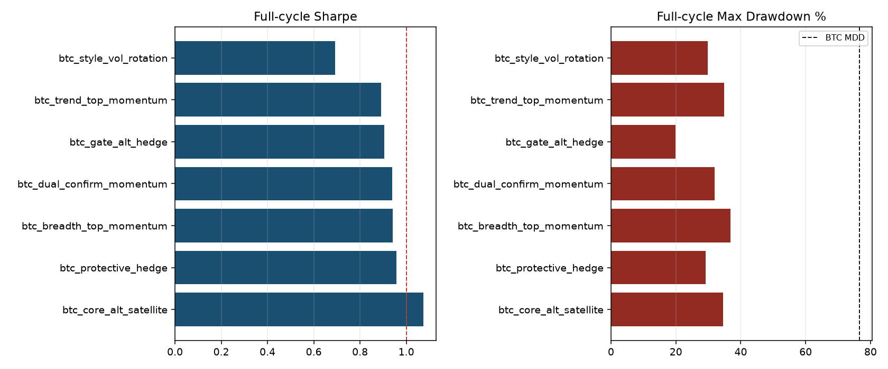
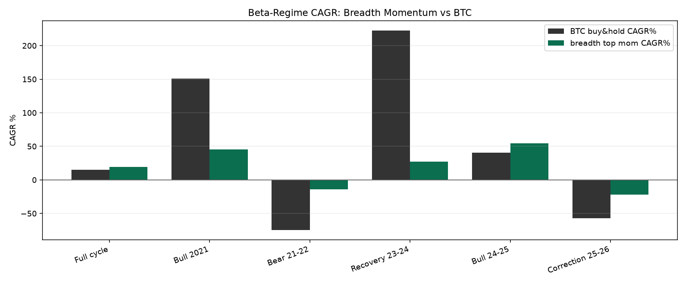

# 加密策略全周期回测报告（2021–2026）

## 范围与方法

- 区间：`2021-01-01 ~ 2026-07-15`
- T-1 收盘信号，T 日收益；多空引擎；含手续费/滑点/空头借券近似
- 单向费率 `0.001`，滑点 `0.0005`，空头日借券 `5e-05`
- 使用 crypto_alpha 研究推荐参数，本报告不再二次选参
- 分段：宏观 beta 分段 + 日历年 + BTC 200DMA 风险开关聚合
- 交易记录：相邻交易日权重变化绝对值 >= 0.01 记为一笔调仓；CSV 目录 `reports/cycle_trades`

## 全周期总览（对比 BTC 买入持有）

- BTC 买入持有：CAGR `15.3%`，Sharpe `0.54`，最大回撤 `76.6%`，总收益 `120.4%`

| 策略 | 总收益 | CAGR | Sharpe | 最大回撤 | 波动 | 成交次数 | 在市时间 | vs BTC超额CAGR |
|---|---:|---:|---:|---:|---:|---:|---:|---:|
| btc_core_alt_satellite | 230.3% | 24.1% | 1.07 | 34.6% | 22.4% | 145 | 46% | +8.7% |
| btc_protective_hedge | 141.6% | 17.3% | 0.96 | 29.2% | 18.4% | 207 | 47% | +1.9% |
| btc_breadth_top_momentum | 163.8% | 19.1% | 0.94 | 36.8% | 20.9% | 152 | 44% | +3.8% |
| btc_dual_confirm_momentum | 154.4% | 18.4% | 0.94 | 32.0% | 20.1% | 217 | 44% | +3.0% |
| btc_gate_alt_hedge | 143.7% | 17.4% | 0.91 | 19.8% | 19.9% | 192 | 48% | +2.1% |
| btc_trend_top_momentum | 143.8% | 17.5% | 0.89 | 34.8% | 20.3% | 160 | 47% | +2.1% |
| btc_style_vol_rotation | 86.8% | 11.9% | 0.69 | 29.8% | 18.9% | 97 | 41% | -3.4% |
| BTC-USDT_buy_hold | 120.4% | 15.3% | 0.54 | 76.6% | 57.7% | 1 | 100% | +0.0% |

## 权益曲线与回撤

## 宏观 Beta 分段表现

### 全周期 2021-2026（2021-01-01 ~ 2026-07-15）

- 声明 beta：`mixed`；实测 200DMA beta：`mixed`
- 说明：完整一轮牛熊震荡
- BTC：CAGR `15.3%`，Sharpe `0.54`，最大回撤 `76.6%`，总收益 `120.4%`

| 策略 | CAGR | Sharpe | 最大回撤 | 总收益 | 超额CAGR | 回撤改善 | 胜BTC收益 | 胜BTC夏普 |
|---|---:|---:|---:|---:|---:|---:|---|---|
| btc_core_alt_satellite | 24.1% | 1.07 | 34.6% | 230.3% | +8.7% | +42.0% | 是 | 是 |
| btc_protective_hedge | 17.3% | 0.96 | 29.2% | 141.6% | +1.9% | +47.5% | 是 | 是 |
| btc_breadth_top_momentum | 19.1% | 0.94 | 36.8% | 163.8% | +3.8% | +39.8% | 是 | 是 |
| btc_dual_confirm_momentum | 18.4% | 0.94 | 32.0% | 154.4% | +3.0% | +44.7% | 是 | 是 |
| btc_gate_alt_hedge | 17.4% | 0.91 | 19.8% | 143.7% | +2.1% | +56.8% | 是 | 是 |
| btc_trend_top_momentum | 17.5% | 0.89 | 34.8% | 143.8% | +2.1% | +41.8% | 是 | 是 |
| btc_style_vol_rotation | 11.9% | 0.69 | 29.8% | 86.8% | -3.4% | +46.8% | 否 | 是 |

### 2021 牛市（2021-01-01 ~ 2021-11-10）

- 声明 beta：`bull`；实测 200DMA beta：`bull`
- 说明：至本轮高点附近
- BTC：CAGR `151.1%`，Sharpe `1.52`，最大回撤 `53.1%`，总收益 `120.8%`

| 策略 | CAGR | Sharpe | 最大回撤 | 总收益 | 超额CAGR | 回撤改善 | 胜BTC收益 | 胜BTC夏普 |
|---|---:|---:|---:|---:|---:|---:|---|---|
| btc_core_alt_satellite | 54.1% | 2.91 | 7.7% | 45.0% | -97.1% | +45.5% | 否 | 是 |
| btc_protective_hedge | 35.3% | 2.72 | 4.7% | 29.7% | -115.8% | +48.5% | 否 | 是 |
| btc_breadth_top_momentum | 45.2% | 2.64 | 6.7% | 37.8% | -106.0% | +46.4% | 否 | 是 |
| btc_trend_top_momentum | 42.0% | 2.64 | 6.3% | 35.2% | -109.1% | +46.8% | 否 | 是 |
| btc_gate_alt_hedge | 38.4% | 2.38 | 7.1% | 32.3% | -112.7% | +46.0% | 否 | 是 |
| btc_dual_confirm_momentum | 38.9% | 2.35 | 6.7% | 32.7% | -112.2% | +46.4% | 否 | 是 |
| btc_style_vol_rotation | 32.6% | 2.14 | 6.1% | 27.5% | -118.5% | +47.1% | 否 | 是 |

### 2021-2022 熊市（2021-11-11 ~ 2022-11-21）

- 声明 beta：`bear`；实测 200DMA beta：`bear`
- 说明：见顶至周期底部
- BTC：CAGR `-74.6%`，Sharpe `-1.74`，最大回撤 `75.9%`，总收益 `-75.7%`

| 策略 | CAGR | Sharpe | 最大回撤 | 总收益 | 超额CAGR | 回撤改善 | 胜BTC收益 | 胜BTC夏普 |
|---|---:|---:|---:|---:|---:|---:|---|---|
| btc_dual_confirm_momentum | -15.0% | -1.22 | 17.8% | -15.4% | +59.6% | +58.2% | 是 | 是 |
| btc_breadth_top_momentum | -14.1% | -1.27 | 18.1% | -14.5% | +60.5% | +57.8% | 是 | 是 |
| btc_style_vol_rotation | -16.9% | -1.31 | 19.1% | -17.3% | +57.8% | +56.8% | 是 | 是 |
| btc_protective_hedge | -11.0% | -1.37 | 14.0% | -11.3% | +63.6% | +61.9% | 是 | 是 |
| btc_core_alt_satellite | -14.9% | -1.48 | 17.3% | -15.3% | +59.7% | +58.6% | 是 | 是 |
| btc_trend_top_momentum | -16.6% | -1.48 | 20.3% | -17.1% | +58.0% | +55.6% | 是 | 是 |
| btc_gate_alt_hedge | -12.8% | -1.58 | 14.5% | -13.1% | +61.9% | +61.4% | 是 | 是 |

### 2023-2024 复苏/ETF牛（2022-11-22 ~ 2024-03-13）

- 声明 beta：`bull`；实测 200DMA beta：`bull`
- 说明：底部反弹至现货 ETF 落地前后
- BTC：CAGR `222.3%`，Sharpe `2.83`，最大回撤 `20.0%`，总收益 `363.0%`

| 策略 | CAGR | Sharpe | 最大回撤 | 总收益 | 超额CAGR | 回撤改善 | 胜BTC收益 | 胜BTC夏普 |
|---|---:|---:|---:|---:|---:|---:|---|---|
| btc_gate_alt_hedge | 55.1% | 1.85 | 19.8% | 77.7% | -167.2% | +0.1% | 否 | 否 |
| btc_core_alt_satellite | 52.7% | 1.71 | 28.7% | 74.1% | -169.6% | -8.7% | 否 | 否 |
| btc_style_vol_rotation | 39.8% | 1.58 | 20.1% | 55.0% | -182.5% | -0.1% | 否 | 否 |
| btc_dual_confirm_momentum | 35.1% | 1.37 | 23.5% | 48.2% | -187.2% | -3.5% | 否 | 否 |
| btc_trend_top_momentum | 29.8% | 1.26 | 24.7% | 40.7% | -192.5% | -4.8% | 否 | 否 |
| btc_protective_hedge | 26.0% | 1.21 | 23.5% | 35.3% | -196.3% | -3.5% | 否 | 否 |
| btc_breadth_top_momentum | 27.4% | 1.13 | 29.4% | 37.4% | -194.9% | -9.4% | 否 | 否 |

### 2024-2025 主升浪（2024-03-14 ~ 2025-10-06）

- 声明 beta：`bull`；实测 200DMA beta：`bull`
- 说明：ETF 后至数据内 ATH
- BTC：CAGR `40.6%`，Sharpe `0.95`，最大回撤 `28.1%`，总收益 `70.6%`

| 策略 | CAGR | Sharpe | 最大回撤 | 总收益 | 超额CAGR | 回撤改善 | 胜BTC收益 | 胜BTC夏普 |
|---|---:|---:|---:|---:|---:|---:|---|---|
| btc_protective_hedge | 49.4% | 1.76 | 15.2% | 87.7% | +8.8% | +12.9% | 是 | 是 |
| btc_breadth_top_momentum | 54.3% | 1.73 | 19.1% | 97.4% | +13.7% | +8.9% | 是 | 是 |
| btc_dual_confirm_momentum | 48.0% | 1.70 | 19.3% | 84.8% | +7.4% | +8.8% | 是 | 是 |
| btc_trend_top_momentum | 48.2% | 1.59 | 18.0% | 85.2% | +7.6% | +10.1% | 是 | 是 |
| btc_core_alt_satellite | 48.5% | 1.48 | 18.7% | 85.8% | +7.9% | +9.4% | 是 | 是 |
| btc_gate_alt_hedge | 26.1% | 1.05 | 16.4% | 43.9% | -14.5% | +11.7% | 否 | 是 |
| btc_style_vol_rotation | 21.2% | 0.93 | 23.7% | 35.2% | -19.4% | +4.4% | 否 | 否 |

### 2025-2026 回调（2025-10-07 ~ 2026-07-15）

- 声明 beta：`bear`；实测 200DMA beta：`bear`
- 说明：ATH 后的深度回调段
- BTC：CAGR `-57.2%`，Sharpe `-1.60`，最大回撤 `53.0%`，总收益 `-48.1%`

| 策略 | CAGR | Sharpe | 最大回撤 | 总收益 | 超额CAGR | 回撤改善 | 胜BTC收益 | 胜BTC夏普 |
|---|---:|---:|---:|---:|---:|---:|---|---|
| btc_breadth_top_momentum | -21.9% | -1.53 | 17.4% | -17.4% | +35.3% | +35.6% | 是 | 是 |
| btc_trend_top_momentum | -20.9% | -1.54 | 16.6% | -16.6% | +36.2% | +36.4% | 是 | 是 |
| btc_protective_hedge | -21.8% | -1.57 | 17.3% | -17.3% | +35.3% | +35.7% | 是 | 是 |
| btc_dual_confirm_momentum | -21.8% | -1.65 | 17.3% | -17.3% | +35.4% | +35.7% | 是 | 否 |
| btc_core_alt_satellite | -21.3% | -1.79 | 16.9% | -16.9% | +35.9% | +36.1% | 是 | 否 |
| btc_gate_alt_hedge | -21.5% | -1.89 | 17.0% | -17.0% | +35.7% | +35.9% | 是 | 否 |
| btc_style_vol_rotation | -19.5% | -2.40 | 15.4% | -15.4% | +37.7% | +37.5% | 是 | 否 |

## 日历年切片

| 年份 | BTC CAGR | BTC Sharpe | BTC MDD | 最佳策略 | 策略CAGR | 策略Sharpe | 策略MDD |
|---|---:|---:|---:|---|---:|---:|---:|
| 日历年 2021 | 57.3% | 0.96 | 53.1% | btc_breadth_top_momentum | 29.8% | 1.79 | 9.7% |
| 日历年 2022 | -64.2% | -1.29 | 66.9% | btc_style_vol_rotation | -7.2% | -0.79 | 11.7% |
| 日历年 2023 | 155.6% | 2.35 | 20.0% | btc_gate_alt_hedge | 40.6% | 1.47 | 19.8% |
| 日历年 2024 | 120.9% | 1.76 | 26.2% | btc_core_alt_satellite | 80.7% | 2.14 | 18.7% |
| 日历年 2025 | -6.4% | 0.05 | 32.0% | btc_style_vol_rotation | 25.4% | 1.19 | 14.1% |
| 日历年 2026YTD | -43.1% | -0.93 | 39.5% | btc_trend_top_momentum | -7.7% | -1.16 | 6.9% |

## BTC 200DMA 风险开关聚合

### risk_on_btc_above_200dma（观测 973 天）

- BTC：CAGR `163.0%`，Sharpe `2.21`，最大回撤 `30.2%`

| 策略 | CAGR | Sharpe | 最大回撤 | 超额CAGR |
|---|---:|---:|---:|---:|
| btc_core_alt_satellite | 75.1% | 1.96 | 21.7% | -87.9% |
| btc_dual_confirm_momentum | 57.7% | 1.80 | 21.0% | -105.3% |
| btc_protective_hedge | 52.0% | 1.77 | 19.7% | -111.0% |
| btc_breadth_top_momentum | 58.9% | 1.76 | 26.1% | -104.1% |
| btc_gate_alt_hedge | 55.5% | 1.74 | 15.6% | -107.5% |
| btc_trend_top_momentum | 55.4% | 1.72 | 22.0% | -107.6% |
| btc_style_vol_rotation | 41.6% | 1.48 | 21.9% | -121.4% |

### risk_off_btc_below_200dma（观测 850 天）

- BTC：CAGR `-55.1%`，Sharpe `-1.14`，最大回撤 `90.0%`

| 策略 | CAGR | Sharpe | 最大回撤 | 超额CAGR |
|---|---:|---:|---:|---:|
| btc_breadth_top_momentum | -10.7% | -1.12 | 25.2% | +44.4% |
| btc_dual_confirm_momentum | -11.4% | -1.17 | 26.4% | +43.8% |
| btc_trend_top_momentum | -11.5% | -1.26 | 26.5% | +43.7% |
| btc_protective_hedge | -9.6% | -1.28 | 22.5% | +45.6% |
| btc_core_alt_satellite | -12.0% | -1.37 | 27.3% | +43.1% |
| btc_gate_alt_hedge | -11.6% | -1.42 | 24.9% | +43.6% |
| btc_style_vol_rotation | -12.2% | -1.44 | 26.1% | +42.9% |

## 交易记录摘要

### btc_trend_top_momentum

- 调仓笔数 `160`；偏多侧动作约 `89`，偏空/减仓动作约 `71`；涉及标的：ADA-USDT, BCH-USDT, BTC-USDT, DOGE-USDT, DOT-USDT, ETC-USDT, ETH-USDT, LINK-USDT, LTC-USDT, SOL-USDT, TRX-USDT, XRP-USDT
- 完整记录：`reports/cycle_trades/trades_btc_trend_top_momentum.csv`

| 日期 | 标的 | 方向 | 权重前 | 权重后 | 价格 |
|---|---|---|---:|---:|---:|
| 2021-08-14 | BTC-USDT | buy | 0.00 | 0.22 | 47080.00 |
| 2021-08-14 | SOL-USDT | buy | 0.00 | 0.13 | 44.11 |
| 2021-08-28 | BTC-USDT | sell | 0.20 | 0.00 | 48892.00 |
| 2021-08-28 | SOL-USDT | sell | 0.20 | 0.11 | 96.17 |
| 2021-08-28 | ADA-USDT | buy | 0.00 | 0.12 | 2.85 |
| 2021-09-11 | SOL-USDT | sell | 0.21 | 0.10 | 179.11 |
| 2021-09-11 | ADA-USDT | buy | 0.09 | 0.11 | 2.64 |
| 2021-09-25 | ADA-USDT | sell | 0.11 | 0.00 | 2.30 |

- … 其余 152 笔见 CSV

### btc_breadth_top_momentum

- 调仓笔数 `152`；偏多侧动作约 `85`，偏空/减仓动作约 `67`；涉及标的：ADA-USDT, BCH-USDT, BTC-USDT, DOGE-USDT, DOT-USDT, ETC-USDT, ETH-USDT, LINK-USDT, LTC-USDT, SOL-USDT, TRX-USDT, XRP-USDT
- 完整记录：`reports/cycle_trades/trades_btc_breadth_top_momentum.csv`

| 日期 | 标的 | 方向 | 权重前 | 权重后 | 价格 |
|---|---|---|---:|---:|---:|
| 2021-08-14 | BTC-USDT | buy | 0.00 | 0.24 | 47080.00 |
| 2021-08-14 | SOL-USDT | buy | 0.00 | 0.14 | 44.11 |
| 2021-08-28 | BTC-USDT | sell | 0.21 | 0.00 | 48892.00 |
| 2021-08-28 | SOL-USDT | sell | 0.22 | 0.12 | 96.17 |
| 2021-08-28 | ADA-USDT | buy | 0.00 | 0.12 | 2.85 |
| 2021-09-11 | SOL-USDT | sell | 0.22 | 0.10 | 179.11 |
| 2021-09-11 | ADA-USDT | buy | 0.10 | 0.12 | 2.64 |
| 2021-09-25 | ADA-USDT | sell | 0.12 | 0.00 | 2.30 |

- … 其余 144 笔见 CSV

### btc_dual_confirm_momentum

- 调仓笔数 `217`；偏多侧动作约 `119`，偏空/减仓动作约 `98`；涉及标的：ADA-USDT, BCH-USDT, BTC-USDT, DOGE-USDT, DOT-USDT, ETC-USDT, ETH-USDT, LINK-USDT, LTC-USDT, SOL-USDT, TRX-USDT, XRP-USDT
- 完整记录：`reports/cycle_trades/trades_btc_dual_confirm_momentum.csv`

| 日期 | 标的 | 方向 | 权重前 | 权重后 | 价格 |
|---|---|---|---:|---:|---:|
| 2021-08-14 | BTC-USDT | buy | 0.00 | 0.24 | 47080.00 |
| 2021-08-14 | SOL-USDT | buy | 0.00 | 0.14 | 44.11 |
| 2021-08-28 | BTC-USDT | sell | 0.21 | 0.00 | 48892.00 |
| 2021-08-28 | ETH-USDT | buy | 0.00 | 0.13 | 3244.83 |
| 2021-08-28 | SOL-USDT | sell | 0.22 | 0.08 | 96.17 |
| 2021-08-28 | ADA-USDT | buy | 0.00 | 0.08 | 2.85 |
| 2021-09-11 | ETH-USDT | sell | 0.13 | 0.00 | 3266.78 |
| 2021-09-11 | SOL-USDT | sell | 0.15 | 0.07 | 179.11 |

- … 其余 209 笔见 CSV

### btc_style_vol_rotation

- 调仓笔数 `97`；偏多侧动作约 `49`，偏空/减仓动作约 `48`；涉及标的：ADA-USDT, BCH-USDT, BTC-USDT, DOGE-USDT, DOT-USDT, ETC-USDT, ETH-USDT, LINK-USDT, SOL-USDT, XRP-USDT
- 完整记录：`reports/cycle_trades/trades_btc_style_vol_rotation.csv`

| 日期 | 标的 | 方向 | 权重前 | 权重后 | 价格 |
|---|---|---|---:|---:|---:|
| 2021-08-21 | SOL-USDT | buy | 0.00 | 0.12 | 73.93 |
| 2021-08-21 | ADA-USDT | buy | 0.00 | 0.15 | 2.44 |
| 2021-09-11 | SOL-USDT | sell | 0.25 | 0.10 | 179.11 |
| 2021-09-11 | ADA-USDT | sell | 0.13 | 0.00 | 2.64 |
| 2021-09-11 | DOT-USDT | buy | 0.00 | 0.11 | 31.56 |
| 2021-10-02 | SOL-USDT | buy | 0.08 | 0.09 | 168.88 |
| 2021-10-02 | DOT-USDT | sell | 0.11 | 0.10 | 32.02 |
| 2021-10-23 | BTC-USDT | buy | 0.00 | 0.21 | 61301.10 |

- … 其余 89 笔见 CSV

### btc_core_alt_satellite

- 调仓笔数 `145`；偏多侧动作约 `78`，偏空/减仓动作约 `67`；涉及标的：BCH-USDT, BTC-USDT, DOGE-USDT, ETH-USDT, LINK-USDT, LTC-USDT, SOL-USDT, TRX-USDT, XRP-USDT
- 完整记录：`reports/cycle_trades/trades_btc_core_alt_satellite.csv`

| 日期 | 标的 | 方向 | 权重前 | 权重后 | 价格 |
|---|---|---|---:|---:|---:|
| 2021-08-14 | BTC-USDT | buy | 0.00 | 0.26 | 47080.00 |
| 2021-08-14 | SOL-USDT | buy | 0.00 | 0.11 | 44.11 |
| 2021-08-28 | BTC-USDT | sell | 0.23 | 0.08 | 48892.00 |
| 2021-09-11 | SOL-USDT | sell | 0.32 | 0.16 | 179.11 |
| 2021-10-09 | SOL-USDT | buy | 0.16 | 0.18 | 156.82 |
| 2021-10-23 | BTC-USDT | buy | 0.09 | 0.10 | 61301.10 |
| 2021-10-23 | SOL-USDT | buy | 0.21 | 0.23 | 197.74 |
| 2021-11-06 | BTC-USDT | buy | 0.10 | 0.11 | 61473.90 |

- … 其余 137 笔见 CSV

### btc_gate_alt_hedge

- 调仓笔数 `192`；偏多侧动作约 `102`，偏空/减仓动作约 `90`；涉及标的：ADA-USDT, BCH-USDT, BTC-USDT, DOGE-USDT, DOT-USDT, ETC-USDT, ETH-USDT, LINK-USDT, LTC-USDT, SOL-USDT, TRX-USDT, XRP-USDT
- 完整记录：`reports/cycle_trades/trades_btc_gate_alt_hedge.csv`

| 日期 | 标的 | 方向 | 权重前 | 权重后 | 价格 |
|---|---|---|---:|---:|---:|
| 2021-08-14 | BTC-USDT | buy | 0.00 | 0.21 | 47080.00 |
| 2021-08-14 | ADA-USDT | buy | 0.00 | 0.17 | 2.19 |
| 2021-08-28 | BTC-USDT | sell | 0.20 | 0.17 | 48892.00 |
| 2021-08-28 | SOL-USDT | buy | 0.00 | 0.14 | 96.17 |
| 2021-08-28 | ADA-USDT | sell | 0.19 | 0.00 | 2.85 |
| 2021-09-11 | BTC-USDT | buy | 0.14 | 0.15 | 45165.70 |
| 2021-09-11 | SOL-USDT | sell | 0.26 | 0.13 | 179.11 |
| 2021-09-25 | BTC-USDT | sell | 0.16 | 0.14 | 42678.00 |

- … 其余 184 笔见 CSV

### btc_protective_hedge

- 调仓笔数 `207`；偏多侧动作约 `113`，偏空/减仓动作约 `94`；涉及标的：ADA-USDT, BCH-USDT, BTC-USDT, DOGE-USDT, DOT-USDT, ETC-USDT, ETH-USDT, LINK-USDT, LTC-USDT, SOL-USDT, TRX-USDT, XRP-USDT
- 完整记录：`reports/cycle_trades/trades_btc_protective_hedge.csv`

| 日期 | 标的 | 方向 | 权重前 | 权重后 | 价格 |
|---|---|---|---:|---:|---:|
| 2021-08-14 | BTC-USDT | buy | 0.00 | 0.18 | 47080.00 |
| 2021-08-14 | SOL-USDT | buy | 0.00 | 0.11 | 44.11 |
| 2021-08-14 | DOT-USDT | short | 0.00 | -0.06 | 22.84 |
| 2021-08-28 | BTC-USDT | sell | 0.16 | 0.00 | 48892.00 |
| 2021-08-28 | SOL-USDT | sell | 0.17 | 0.09 | 96.17 |
| 2021-08-28 | ADA-USDT | buy | 0.00 | 0.10 | 2.85 |
| 2021-08-28 | DOGE-USDT | short | 0.00 | -0.04 | 0.29 |
| 2021-08-28 | DOT-USDT | cover | -0.06 | 0.00 | 25.96 |

- … 其余 199 笔见 CSV

## 结论要点

- 全周期应同时看 CAGR、Sharpe 与最大回撤；单纯追高收益在熊市段会被打回。
- BTC 门控类策略的核心价值通常体现在熊市/风险关阶段的回撤控制，而非每个牛市都跑赢 BTC。
- 交易记录显示多数增强策略以低频调仓 + 大量现金期为主，这是夏普提升的重要来源。

详情 JSON：`reports/cycle_full_results.json`（含完整权益与交易数组）。
