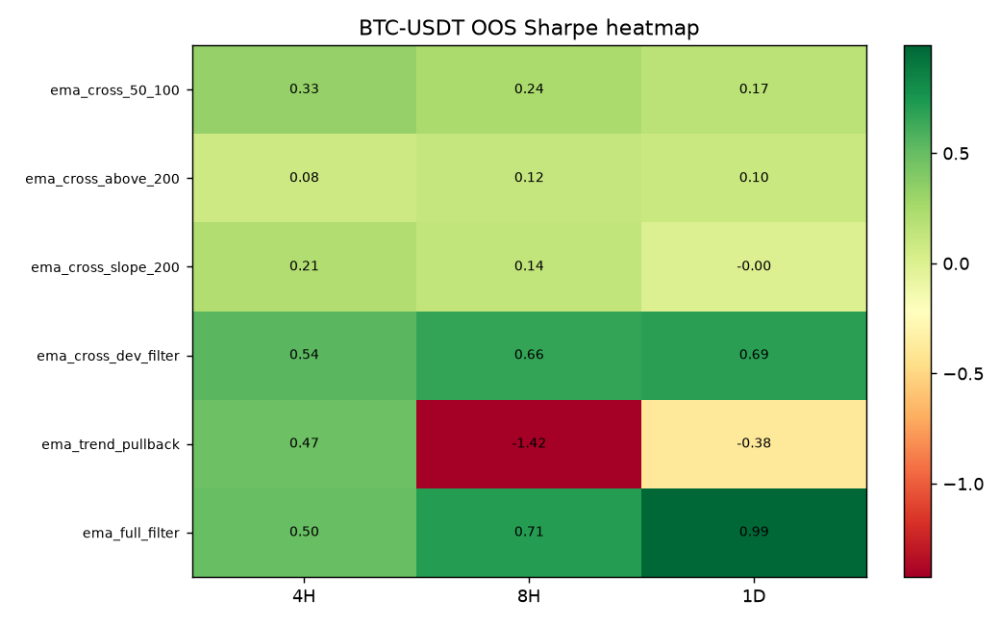
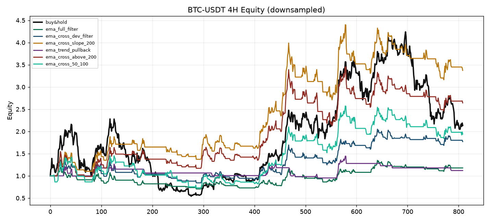
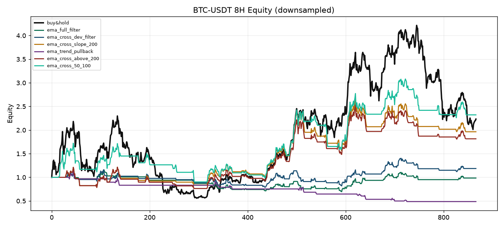
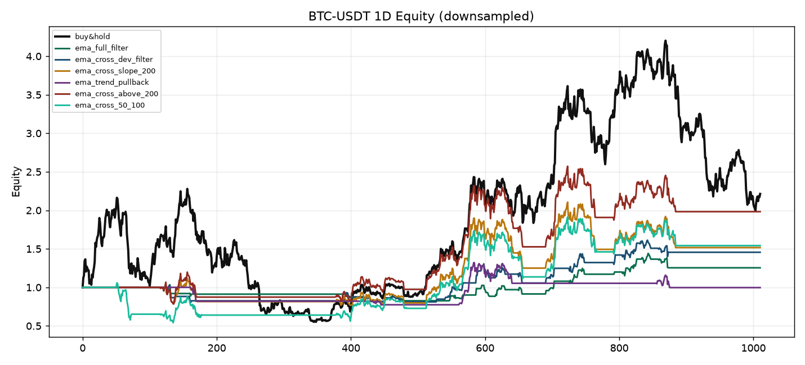
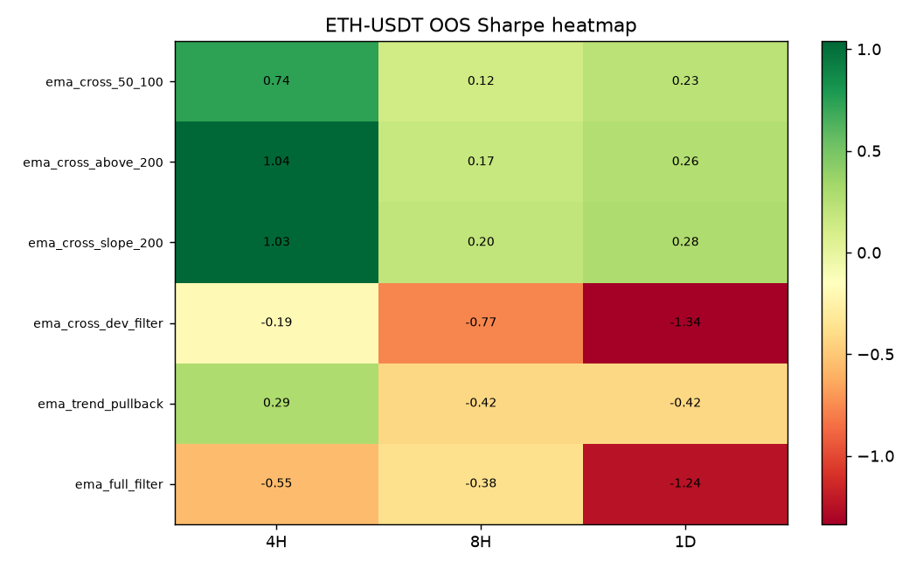
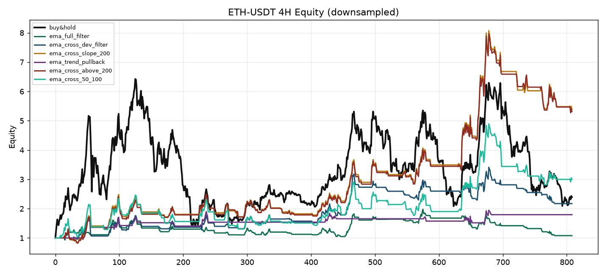
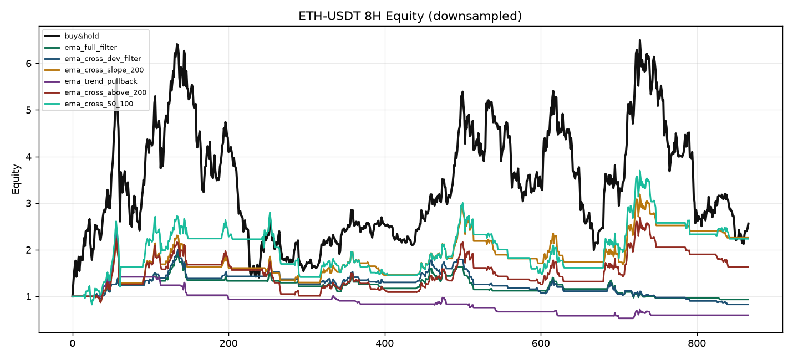
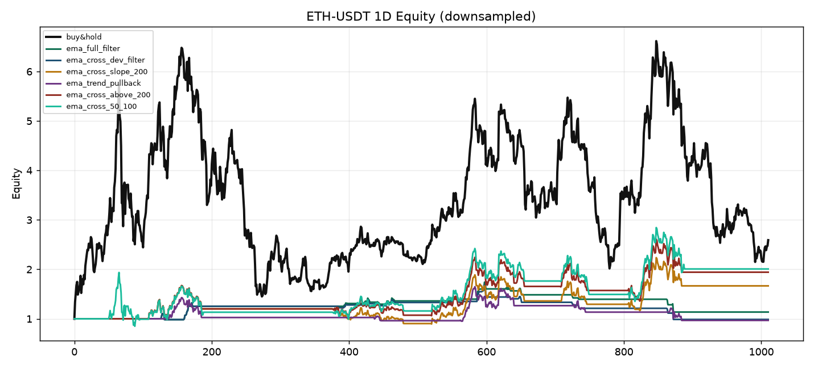

# BTC/ETH EMA50/100 策略回测报告（4H / 8H / 1D）

## 策略设计

- **基础信号**：EMA50 上穿/位于 EMA100 上方做多，否则空仓（状态持仓，非仅交叉瞬间）。
- **EMA200 参考**：收盘与快线需站上 EMA200，确认大趋势。
- **斜率过滤**：EMA200 / EMA50 斜率需大于阈值，过滤横盘与下行段。
- **偏离率**：相对 EMA50 的 (P-EMA)/EMA；过高不追，过低可等回撤再入（pullback 版）。
- **综合版 `ema_full_filter`**：交叉 + EMA200 + 双斜率 + 偏离率带。

## 方法

- 信号：`K 线收盘产生信号，下一根 K 线收益；含手续费与滑点`
- 费率/滑点：`0.001` / `0.0005`
- 选参：`仅用训练期夏普-0.3*MDD 选参；样本外只用于评价`
- 数据源：`https://www.okx.com/api/v5/market/history-candles`；区间 `2021-01-01 ~ 2026-07-15`

## 全样本冠军速览（按 Sharpe）

| 市场 | 周期 | 最佳策略 | CAGR | Sharpe | MDD | 总收益 | vs BH超额CAGR |
|---|---|---|---:|---:|---:|---:|---:|
| BTC-USDT | 4H | ema_cross_slope_200 | 24.6% | 0.81 | 32.7% | 237.7% | +9.2% |
| BTC-USDT | 8H | ema_cross_50_100 | 16.4% | 0.60 | 50.9% | 132.2% | +0.9% |
| BTC-USDT | 1D | ema_cross_above_200 | 13.1% | 0.54 | 35.6% | 98.3% | -2.2% |
| ETH-USDT | 4H | ema_cross_slope_200 | 37.4% | 0.94 | 37.1% | 480.2% | +18.8% |
| ETH-USDT | 8H | ema_cross_slope_200 | 15.8% | 0.56 | 45.7% | 125.7% | -3.0% |
| ETH-USDT | 1D | ema_cross_50_100 | 13.4% | 0.50 | 56.7% | 100.7% | -5.6% |

## 样本外推荐（按 OOS Sharpe）

| 市场 | 周期 | 推荐策略 | OOS CAGR | OOS Sharpe | OOS MDD | 胜BH夏普 |
|---|---|---|---:|---:|---:|---|
| BTC-USDT | 4H | ema_cross_dev_filter | 10.2% | 0.54 | 21.0% | 是 |
| BTC-USDT | 8H | ema_full_filter | 12.6% | 0.71 | 17.2% | 是 |
| BTC-USDT | 1D | ema_full_filter | 17.0% | 0.99 | 13.1% | 是 |
| ETH-USDT | 4H | ema_cross_above_200 | 37.2% | 1.04 | 36.6% | 是 |
| ETH-USDT | 8H | ema_cross_slope_200 | 1.4% | 0.20 | 29.7% | 是 |
| ETH-USDT | 1D | ema_cross_slope_200 | 3.4% | 0.28 | 37.2% | 是 |

## 分市场明细

### BTC-USDT

#### 4H

- 区间 `2021-01-01T00:00:00+00:00` ~ `2026-07-15T20:00:00+00:00`；训练截止 `2024-04-28T00:00:00+00:00`；样本外起 `2024-04-28T04:00:00+00:00`
- 买入持有全样本：CAGR `15.4%`，Sharpe `0.54`，MDD `77.0%`；样本外 Sharpe `0.24`

| 策略 | 推荐参数摘要 | 全样本CAGR | Sharpe | MDD | 在市 | 样本外CAGR | 样本外Sharpe | 胜BH夏普(OOS) |
|---|---|---:|---:|---:|---:|---:|---:|---|
| ema_cross_dev_filter | fast=50, slow=100, trend=200, slope_lookback=5 | 10.8% | 0.51 | 39.7% | 32% | 10.2% | 0.54 | 是 |
| ema_full_filter | fast=50, slow=100, trend=200, slope_lookback=5 | 3.0% | 0.24 | 41.0% | 27% | 8.7% | 0.50 | 是 |
| ema_trend_pullback | fast=50, slow=100, trend=200, slope_lookback=5 | 2.1% | 0.20 | 28.6% | 11% | 6.0% | 0.47 | 是 |
| ema_cross_50_100 | fast=50, slow=100 | 13.4% | 0.52 | 51.2% | 50% | 5.4% | 0.33 | 是 |
| ema_cross_slope_200 | fast=50, slow=100, trend=200, slope_lookback=3 | 24.6% | 0.81 | 32.7% | 44% | 2.1% | 0.21 | 否 |
| ema_cross_above_200 | fast=50, slow=100, trend=200 | 19.1% | 0.68 | 38.8% | 44% | -1.4% | 0.08 | 否 |

#### 8H

- 区间 `2021-01-01T00:00:00+00:00` ~ `2026-07-15T16:00:00+00:00`；训练截止 `2024-04-27T16:00:00+00:00`；样本外起 `2024-04-28T00:00:00+00:00`
- 买入持有全样本：CAGR `15.5%`，Sharpe `0.54`，MDD `76.9%`；样本外 Sharpe `0.25`

| 策略 | 推荐参数摘要 | 全样本CAGR | Sharpe | MDD | 在市 | 样本外CAGR | 样本外Sharpe | 胜BH夏普(OOS) |
|---|---|---:|---:|---:|---:|---:|---:|---|
| ema_full_filter | fast=50, slow=100, trend=200, slope_lookback=5 | -0.3% | 0.09 | 40.0% | 22% | 12.6% | 0.71 | 是 |
| ema_cross_dev_filter | fast=50, slow=100, trend=200, slope_lookback=5 | 3.1% | 0.25 | 35.1% | 28% | 12.7% | 0.66 | 是 |
| ema_cross_50_100 | fast=50, slow=100 | 16.4% | 0.60 | 50.9% | 49% | 2.8% | 0.24 | 否 |
| ema_cross_slope_200 | fast=50, slow=100, trend=200, slope_lookback=5 | 13.0% | 0.55 | 36.9% | 43% | 0.3% | 0.14 | 否 |
| ema_cross_above_200 | fast=50, slow=100, trend=200 | 11.4% | 0.50 | 38.5% | 43% | -0.2% | 0.12 | 否 |
| ema_trend_pullback | fast=50, slow=100, trend=200, slope_lookback=5 | -12.2% | -0.78 | 58.0% | 9% | -14.3% | -1.42 | 否 |

#### 1D

- 区间 `2021-01-01T00:00:00+00:00` ~ `2026-07-15T00:00:00+00:00`；训练截止 `2024-04-27T00:00:00+00:00`；样本外起 `2024-04-28T00:00:00+00:00`
- 买入持有全样本：CAGR `15.3%`，Sharpe `0.54`，MDD `76.6%`；样本外 Sharpe `0.25`

| 策略 | 推荐参数摘要 | 全样本CAGR | Sharpe | MDD | 在市 | 样本外CAGR | 样本外Sharpe | 胜BH夏普(OOS) |
|---|---|---:|---:|---:|---:|---:|---:|---|
| ema_full_filter | fast=50, slow=100, trend=200, slope_lookback=5 | 4.2% | 0.34 | 22.3% | 13% | 17.0% | 0.99 | 是 |
| ema_cross_dev_filter | fast=50, slow=100, trend=200, slope_lookback=5 | 7.0% | 0.47 | 23.5% | 17% | 12.3% | 0.69 | 是 |
| ema_cross_50_100 | fast=50, slow=100 | 8.1% | 0.40 | 49.2% | 50% | 0.1% | 0.17 | 否 |
| ema_cross_above_200 | fast=50, slow=100, trend=200 | 13.1% | 0.54 | 35.6% | 44% | -1.7% | 0.10 | 否 |
| ema_cross_slope_200 | fast=50, slow=100, trend=200, slope_lookback=8 | 7.8% | 0.39 | 35.6% | 43% | -4.7% | -0.00 | 否 |
| ema_trend_pullback | fast=50, slow=100, trend=200, slope_lookback=5 | -0.1% | 0.09 | 26.2% | 12% | -7.1% | -0.38 | 否 |

### ETH-USDT

#### 4H

- 区间 `2021-01-01T00:00:00+00:00` ~ `2026-07-15T20:00:00+00:00`；训练截止 `2024-04-28T00:00:00+00:00`；样本外起 `2024-04-28T04:00:00+00:00`
- 买入持有全样本：CAGR `18.6%`，Sharpe `0.61`，MDD `81.1%`；样本外 Sharpe `-0.03`

| 策略 | 推荐参数摘要 | 全样本CAGR | Sharpe | MDD | 在市 | 样本外CAGR | 样本外Sharpe | 胜BH夏普(OOS) |
|---|---|---:|---:|---:|---:|---:|---:|---|
| ema_cross_above_200 | fast=50, slow=100, trend=200 | 37.0% | 0.93 | 38.9% | 41% | 37.2% | 1.04 | 是 |
| ema_cross_slope_200 | fast=50, slow=100, trend=200, slope_lookback=5 | 37.4% | 0.94 | 37.1% | 41% | 36.8% | 1.03 | 是 |
| ema_cross_50_100 | fast=50, slow=100 | 23.5% | 0.67 | 48.1% | 46% | 24.0% | 0.74 | 是 |
| ema_trend_pullback | fast=50, slow=100, trend=200, slope_lookback=5 | 11.1% | 0.54 | 32.0% | 10% | 3.7% | 0.29 | 是 |
| ema_cross_dev_filter | fast=50, slow=100, trend=200, slope_lookback=5 | 15.3% | 0.57 | 40.3% | 29% | -9.3% | -0.19 | 否 |
| ema_full_filter | fast=50, slow=100, trend=200, slope_lookback=8 | 1.8% | 0.21 | 46.0% | 23% | -15.8% | -0.55 | 否 |

#### 8H

- 区间 `2021-01-01T00:00:00+00:00` ~ `2026-07-15T16:00:00+00:00`；训练截止 `2024-04-27T16:00:00+00:00`；样本外起 `2024-04-28T00:00:00+00:00`
- 买入持有全样本：CAGR `18.8%`，Sharpe `0.60`，MDD `80.3%`；样本外 Sharpe `-0.03`

| 策略 | 推荐参数摘要 | 全样本CAGR | Sharpe | MDD | 在市 | 样本外CAGR | 样本外Sharpe | 胜BH夏普(OOS) |
|---|---|---:|---:|---:|---:|---:|---:|---|
| ema_cross_slope_200 | fast=50, slow=100, trend=200, slope_lookback=8 | 15.8% | 0.56 | 45.7% | 37% | 1.4% | 0.20 | 是 |
| ema_cross_above_200 | fast=50, slow=100, trend=200 | 9.1% | 0.42 | 56.7% | 41% | 0.2% | 0.17 | 是 |
| ema_cross_50_100 | fast=50, slow=100 | 15.4% | 0.54 | 56.7% | 47% | -2.2% | 0.12 | 是 |
| ema_full_filter | fast=50, slow=100, trend=200, slope_lookback=5 | -1.2% | 0.09 | 51.5% | 16% | -8.9% | -0.38 | 否 |
| ema_trend_pullback | fast=50, slow=100, trend=200, slope_lookback=5 | -8.9% | -0.19 | 78.9% | 13% | -9.9% | -0.42 | 否 |
| ema_cross_dev_filter | fast=50, slow=100, trend=200, slope_lookback=5 | -3.4% | 0.02 | 58.8% | 20% | -17.2% | -0.77 | 否 |

#### 1D

- 区间 `2021-01-01T00:00:00+00:00` ~ `2026-07-15T00:00:00+00:00`；训练截止 `2024-04-27T00:00:00+00:00`；样本外起 `2024-04-28T00:00:00+00:00`
- 买入持有全样本：CAGR `19.0%`，Sharpe `0.61`，MDD `79.3%`；样本外 Sharpe `0.00`

| 策略 | 推荐参数摘要 | 全样本CAGR | Sharpe | MDD | 在市 | 样本外CAGR | 样本外Sharpe | 胜BH夏普(OOS) |
|---|---|---:|---:|---:|---:|---:|---:|---|
| ema_cross_slope_200 | fast=50, slow=100, trend=200, slope_lookback=5 | 9.6% | 0.43 | 47.3% | 41% | 3.4% | 0.28 | 是 |
| ema_cross_above_200 | fast=50, slow=100, trend=200 | 12.7% | 0.49 | 40.9% | 41% | 2.6% | 0.26 | 是 |
| ema_cross_50_100 | fast=50, slow=100 | 13.4% | 0.50 | 56.7% | 49% | 0.6% | 0.23 | 是 |
| ema_trend_pullback | fast=50, slow=100, trend=200, slope_lookback=5 | -0.6% | 0.11 | 42.6% | 17% | -13.9% | -0.42 | 否 |
| ema_full_filter | fast=50, slow=100, trend=200, slope_lookback=5 | 2.3% | 0.23 | 34.8% | 6% | -14.4% | -1.24 | 否 |
| ema_cross_dev_filter | fast=50, slow=100, trend=200, slope_lookback=5 | -0.2% | 0.06 | 41.4% | 6% | -15.7% | -1.34 | 否 |

## 结论与使用建议

- **优先看样本外**：全样本冠军常过拟合；实盘候选以 OOS Sharpe 为主。
- **ETH 4H**：`ema_cross_above_200` / `ema_cross_slope_200` 样本外 Sharpe≈1.0+，EMA200 过滤有效。
- **BTC 1D**：`ema_full_filter`（斜率+偏离率带）样本外 Sharpe 接近 1，适合稳健日线执行。
- **BTC 4H/8H**：纯交叉噪声大；`ema_cross_dev_filter` / `ema_full_filter` 更能保住弱市夏普。
- 偏离率过滤减少追高；回撤版交易更少但容易错过单边，按风险偏好选择。

详情 JSON：`reports/ema_results.json`。
